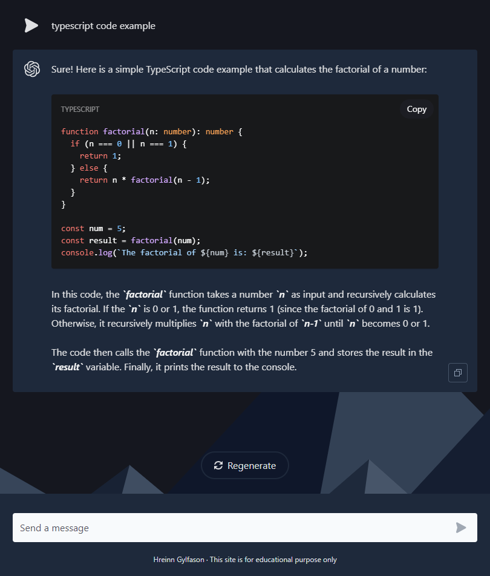

# SvelteKit ChatGPT



## Description

ChatGPT app built with SvelteKit.

## Built With

- [SvelteKit](https://kit.svelte.dev/)
- [OpenAI API](https://platform.openai.com/overview)
- [Tailwind CSS](https://tailwindcss.com/)
- [Skeleton UI toolkit](https://www.skeleton.dev/)

## To do

- Refactor and simplify code.
- Improve regex and/or code for catching code blocks.
- Convert to TypeScript.
- Improve design and layout.

## Getting Started

### Installing

1. Clone the repo:

```bash
git clone git@github.com:baresi687/sveltekit-chatgpt.git
```

2. Install the dependencies:

```
npm install
```

3. Sign up with [OpenAI](https://platform.openai.com/account/api-keys) and create an API key.
- Create a file called **.env.production** in project root with the contents of **VITE_CHATGPT_KEY=YOUR_API_KEY** 


### Running

To run the app, run the following commands:

```bash
npm run build
npm run preview
```

## Deployed site

[SvelteKit ChatGPT](https://sveltekit-chatgpt-hreinn.netlify.app/)

## Contact

[My LinkedIn page](https://www.linkedin.com/in/hreinn-gylfason-b9a48521a/)
